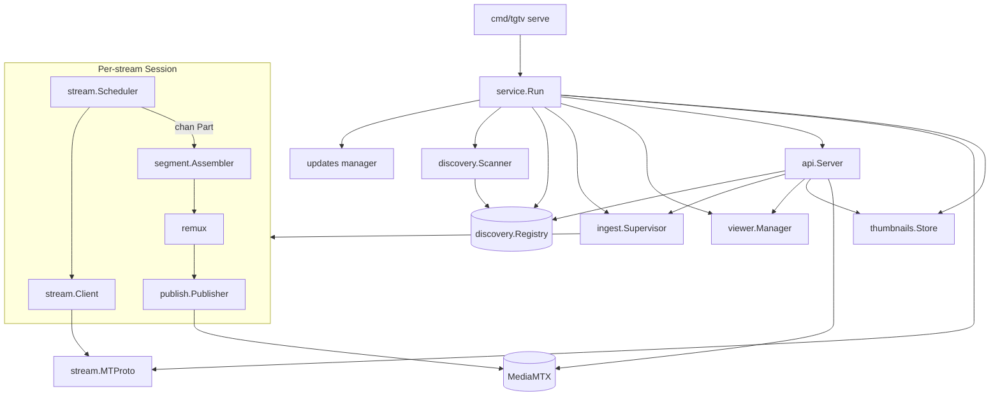
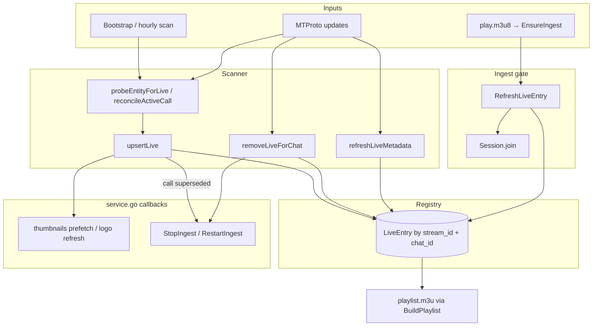
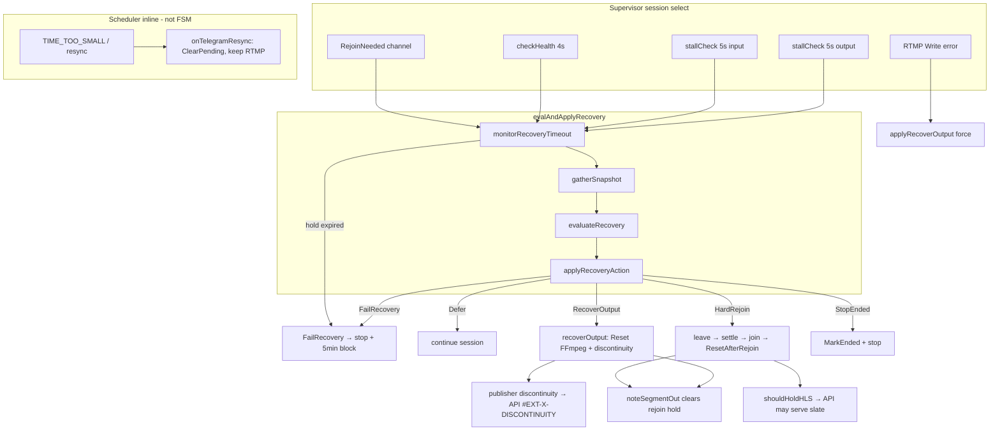

# Architecture & Design

Repository: [github.com/aleskxyz/tgtv](https://github.com/aleskxyz/tgtv)

This document describes the **tgtv** codebase: what it does, how components connect, and which invariants must be preserved when changing code. It is written for new developers and automated agents reading the repository cold.

---

## 1. Purpose

### What the binary does

tgtv is a long-running service that:

1. Logs into Telegram with a user account (gotd session file).
2. Watches channels and supergroups the account can see for **active group-call broadcasts** (live streams).
3. When a viewer opens a stream URL, **joins** that call as a passive receiver, downloads 1-second media chunks from Telegram, remuxes them to MPEG-TS, and publishes to RTMP.
4. Serves a master **M3U playlist** plus proxied **HLS** segments so IPTV apps (VLC, Jellyfin, etc.) can play the lives.

```text
Telegram MTProto                 tgtv                           IPTV client
────────────────                 ──────                           ───────────
group call live         ──►   discovery → ingest → remux   ──►   GET /p/{secret}/playlist.m3u
upload.getFile (1 s)           RTMP → MediaMTX → HLS proxy        GET /p/{secret}/hls/.../*.ts
```

### Why it is built this way

Telegram does not give you a direct HLS URL for channel lives. The supported receive path is MTProto: join the group call, then poll `upload.getFile` with `inputGroupCallStream` for each 1-second segment. tgtv implements that poll loop (the **scheduler**), transforms each chunk for standard players (FFmpeg remux), and bridges to HLS via MediaMTX.

### Scope boundaries

**In scope:** Telegram **channels** and **supergroups** that have an active group call (live broadcast).

**Out of scope:**

- Basic groups (different chat type; not wired in discovery).
- Publishing audio/video *into* a call (send path).
- Treating the broadcast as a continuous TCP/WebRTC stream — data is always **discrete 1 s parts**.

**Session storage:** gotd JSON session at `{SESSION_DIR}/{SESSION_NAME}.json` (from `tgtv login`). Format is specific to gotd and this binary.

**Playback pacing:** Early builds could emit remuxed segments faster than 1/s, overflowing MediaMTX's ~45-segment HLS window and stalling players after ~15–30 s. `scheduler.render()` now enforces ~1 Hz output.

### CLI entry (`cmd/tgtv/main.go`)

| Command | Role |
|---------|------|
| `login` | Interactive Telegram auth; writes session JSON under `SESSION_DIR`. |
| `logout` | Remote `auth.logOut`; deletes local session only if logout succeeded. |
| `status` | Prints whether the session file exists and is authorized. |
| `serve` | Runs the full service (discovery, HTTP, ingest supervisor). |
| `url` | Prints the M3U URL using the path secret. |
| `url rotate` | Generates a new path secret file. |

---

## 2. Repository layout

Each top-level package has a single primary concern. Dependencies generally flow **inward**: `api` and `service` orchestrate; `stream` and below implement media plumbing.

```text
cmd/tgtv/main.go              CLI: parse args, load config, dispatch commands

internal/
  service/                    Glue: one process, one Telegram connection, all goroutines
  auth/                       Telegram client construction and login/logout
  config/                     Environment variables, persisted secrets, zap logger setup
  discovery/                  Find lives, keep registry, react to Telegram updates
  ingest/                     Start/stop per-stream pipelines; recovery when things break
  stream/                     Download chunks from Telegram (scheduler is the core)
  segment/                    Decode Telegram's binary wrapper; pair audio + video
  remux/                      Run FFmpeg to produce MPEG-TS from each part
  media/                      Map container names to FFmpeg options
  publish/                    Long-lived FFmpeg RTMP process per active stream
  api/                        HTTP surface for playlists, HLS proxy, thumbnails
  thumbnails/                 Cache channel profile photos for M3U metadata and logo overlay
  viewer/                     Remember who is watching; stop ingest when idle
```

**`service`** is intentionally thin: it constructs objects and wires callbacks (e.g. "when live ends → stop ingest"). It should not grow ingest logic.

**`stream`** is the largest algorithmic package. The **scheduler** mirrors Telegram's segment download state machine (buffer, bootstrap, resync, paced output).

**`ingest`** owns **one Session per active stream** — the unit of join, scheduler, remux, and RTMP.

The directory `vendor-gotd-td-v0.122.0/` is a local copy of gotd sources for reference while reading Telegram client code; **`go.mod` does not import it**.

---

## 3. Runtime graph

### Single process model

`tgtv serve` → `service.Run()` runs inside **one** gotd `client.Run` callback. That means:

- One MTProto connection (plus extra DC connections opened on demand for stream datacenters).
- One shared `stream.MTProto` facade used by all ingests.
- Discovery, HTTP, and all ingest sessions are goroutines in the same OS process.



### Startup sequence

1. **Config and secrets** — Load env; create or read path secret and MediaMTX CDN secret from `CONFIG_DIR` if not in env.
2. **Telegram connect** — gotd session; register update dispatcher for real-time events.
3. **Updates loop** — Background goroutine runs `gaps.Run`; on disconnect, exponential backoff restart (caps at 60 s).
4. **Discovery** — Bootstrap full dialog scan; then handle live updates; hourly full scan as safety net.
5. **Viewer manager** — 1 Hz ticker for idle detection.
6. **HTTP server** — Binds `HTTP_HOST:HTTP_PORT`; serves M3U/HLS/thumbnails.

Ingest sessions are **not** started at boot. They start lazily when a client hits `play.m3u8` (or when internal logic calls `EnsureIngest`).

### Shutdown sequence

Order matters so HTTP clients get clean close and FFmpeg children are reaped:

1. Stop accepting HTTP (`Shutdown` with timeout).
2. Stop scanner (cancel scan context, wait for goroutine).
3. Stop viewer manager.
4. `supervisor.StopAll()` — set `shuttingDown`, cancel bootstrapping ingests, `StopIngest` each session.
5. Close MTProto DC pools.

---

## 4. Data flow

### 4.1 Discovery — how lives appear in the playlist

Discovery answers: *which chats are live right now, and what is their stable stream ID?*

Three cooperating layers (see also §4.1.1):

| Layer | When | Code |
|-------|------|------|
| Bootstrap + hourly scan | `serve` start; every `FULL_SCAN_INTERVAL_SECONDS` (default 3600) | `scanner.scheduleFullScan` → `runFullScan` |
| Push updates | Continuous while connected | `handler.go` on `UpdateGroupCall`, `UpdateChannel`, `UpdateChannelParticipant` |
| Pre-ingest verify | Each `EnsureIngest` before join | `refresh.go` `RefreshLiveEntry` |

Discovery runs **concurrently** with active ingests — scans are never paused while streaming.

#### 4.1.1 Scanner state (in-memory indexes)

`Scanner` tracks membership and call routing beyond the registry:

| Map / field | Purpose |
|-------------|---------|
| `memberChats` | Chats the account is currently a member of (watchlist) |
| `callIndicator[chatID]` | Last seen `Channel.CallActive && CallNotEmpty` |
| `callToChat[callID]` | Resolve `UpdateGroupCall` when `chat_id` missing |
| `seenCalls{chatID,callID}` | Dedup / routing for orphan call updates |
| `probingCalls` | Single-flight guard for background call→chat resolution |
| `floodBlockedUntil` | Defer scans after `FLOOD_WAIT`; reschedule when backoff expires |

Channel access hashes are stored in `Registry.channelAccess` (via `rememberChannel`) for later `channels.getChannels` without a full dialog walk.

**Live indicator:** `hasActiveCallIndicator` — `*tg.Channel` with `CallActive && CallNotEmpty`. Basic groups (`*tg.Chat`) are ignored everywhere.

#### 4.1.2 Event-driven paths (`handler.go`)

| Update | Condition | Action |
|--------|-----------|--------|
| `UpdateGroupCall` → `GroupCallDiscarded` | chat known | `removeLiveForChat` |
| `UpdateGroupCall` → `GroupCallDiscarded` | chat unknown | `removeLiveByCallID` |
| `UpdateGroupCall` → `GroupCall` | `ScheduleDate != 0` | ignore (scheduled, not live) |
| `UpdateGroupCall` → `GroupCall` | chat known | `upsertLive` (verified) |
| `UpdateGroupCall` → `GroupCall` | chat unknown | `scheduleProbeGroupCall` — scan member chats for matching `call_id` |
| `UpdateChannel` | basic group / left | drop membership, remove live |
| `UpdateChannel` | indicator rose | `probeEntityForLive` |
| `UpdateChannel` | indicator fell | `verifyCallLive` — remove only on `CallLiveNo` |
| `UpdateChannel` | indicator still on | `reconcileActiveCall` (call ID supersession, metadata) |
| `UpdateChannel` | no indicator | `refreshLiveMetadata` (title/photo for active entry) |
| `UpdateChannelParticipant` | self joined | `applyEntityMembership` |
| `UpdateChannelParticipant` | self left | `dropMembership`, `removeLiveForChat` |

**Removal policy:** transient RPC errors → `CallLiveUnknown` → **do not** remove. Only `GROUPCALL_INVALID` / definitive not-live → `MarkEnded`.

#### 4.1.3 Full scan algorithm (`runFullScan`)

```text
GetDialogs (batch 100)
  for each channel dialog:
    remember channel access hash
    if left / lost access → removeLiveForChat
    track memberChats
    if CallActive indicator:
      probeEntityForLive → channels.getFullChannel → phone.getGroupCall
    else if indicator was on before:
      verifyCallLive on registry entry
    sleep SCAN_DIALOG_DELAY_SECONDS (default 0.35 s)

  if scan interrupted by flood → skip membership cleanup
  else:
    remove lives for memberChats no longer in dialogs
    for registry entries not probed this scan but still member:
      verifyCallLive — remove on CallLiveNo, keep on Unknown
```

Scans are single-flight with queued follow-up (`scanPending`). Active scan cancelled on shutdown.

#### 4.1.4 `upsertLive` and removal

**Upsert path:**

1. If `verified == false` and `accessHash != 0`, optional `VerifyCallStillLive` (15 s timeout) — skip upsert on `CallLiveNo`.
2. `registry.Upsert` — stable `stream_id = MakeStreamID(chatID)`; detects `callSuperseded` when `call_id` changes.
3. `onCallSuperseded(streamID)` → `supervisor.RestartIngest` (fresh access hash without idle wait).
4. `onLiveDiscovered(chatID)` on new or reactivated entry → thumbnail prefetch.

**Removal path (`removeLiveForChat`):**

1. Clear scanner call maps for chat.
2. `registry.MarkEnded` → status `ended`.
3. `onLiveEnded(streamID)` → `StopIngest` if running.
4. `registry.RemoveEndedChat` — delete entry so playlist omits it.

#### 4.1.5 Registry model (`registry.go`)

| Field | Notes |
|-------|-------|
| `stream_id` | `SHA256(chatID)` first 12 hex chars — **stable across call sessions** |
| `call_id` / `call_access_hash` | Updated in place on supersession |
| `title` | `mergeTitle` — non-empty incoming wins when different |
| `status` | `discovered` → `ingesting` → `streaming` → `ended` (set by ingest supervisor) |

`Snapshot` / `SnapshotByChat` return copies; `ended` entries are invisible to HTTP playlist.

**Registry statuses** trace the operational lifecycle:

- `discovered` — known live, not necessarily ingesting.
- `ingesting` — session started, may still be joining or bootstrapping.
- `streaming` — at least one MPEG-TS chunk reached RTMP.
- `ended` — call finished or removed from registry.

The master M3U (`api/hls.go` `BuildPlaylist`) lists entries that are not `ended` and not blocked by recovery failure.

#### 4.1.6 Service callbacks (`service.go`)

| Callback | Effect |
|----------|--------|
| `SetOnChannelSeen` | `thumbs.RememberChannel` — cache access hash for photo download |
| `SetOnLiveDiscovered` | `thumbs.Prefetch` for new live |
| `SetOnLiveMetadataUpdated` | `SyncPhotoFromChat`; on change → `RefreshLogoForChat` + JPEG prefetch |
| `SetOnLiveEnded` | `StopIngest` if ingesting |
| `SetOnCallSuperseded` | `RestartIngest` |

gotd wiring: `scanner.Register(UpdateDispatcher)` + `gaps.Run` updates manager with exponential restart backoff (1 s → 60 s cap). No periodic registry poll between events.

#### 4.1.7 Pre-ingest refresh (`RefreshLiveEntry`)

Called from `supervisor.startIngest` (30 s timeout) **before** join:

| RPC outcome | Action |
|-------------|--------|
| `phone.getGroupCall` OK + call matches | `verifyCachedCall` or return cached entry |
| `GROUPCALL_INVALID` | `MarkEnded` → `StreamEndedError` |
| `FLOOD_WAIT` | `trustCachedLive` — proceed with cached hash if present |
| Transient / network error | `useCachedLive` — do not mark ended (native LivePlayer reschedules) |
| Chat has no active call in `getFullChannel` | double-check old call via `checkCallStillLive`; else `no active call` |
| Call ID drift vs registry | `UpdateCallInfo` + `Reactivate` |

This is the last gate before MTProto join — discovery may list a stale entry until refresh or the next update/scan removes it.

#### 4.1.8 End-to-end discovery flow



#### 4.1.9 Playlist item lifecycle (visibility vs ingest)

A **playlist item** is one `#EXTINF` block in `playlist.m3u` pointing at `/streams/{stream_id}/play.m3u8`. Its lifecycle is separate from ingest session state — an item can stay listed while ingest is stopped.

**Inclusion rules** (`api/hls.go` `BuildPlaylist`):

| Rule | Effect |
|------|--------|
| `registry.ActiveLives()` | All entries where `status != ended` |
| `skipStream` callback | `ingest.IsRecoveryFailed(streamID)` — omitted from M3U |
| Sort | By title (case-insensitive) |
| Status field | **Not** a filter — `discovered`, `ingesting`, and `streaming` all appear the same in the master playlist |

Registry `status` is operational metadata for logging and internal state; clients only see the stream URL and EPG tags.

**Lifecycle diagram:**

```text
                    ┌─────────────────────────────────────────┐
                    │  IN playlist.m3u (ActiveLives, not ended) │
                    └─────────────────────────────────────────┘
         add ▲                              │ remove
              │                              ▼
   discovery upsert              MarkEnded + RemoveEndedChat
   (scan / UpdateGroupCall)      (call ended, left channel, refresh fail, …)
              │
              │  hide temporarily (still in registry)
              ├──── FailRecovery → IsRecoveryFailed (5 min block)
              │
              │  metadata only (stay listed, same stream_id)
              ├──── title update (UpdateChannel / refreshLiveMetadata)
              ├──── logo ?v= bump (PhotoID change → thumbnail cache)
              └──── call supersession (call_id changes, URL unchanged)

Ingest (on demand, not required to stay listed):
  play.m3u8 → EnsureIngest
    → RefreshLiveEntry
    → Session.run
    → SetStatus(ingesting) after bootstrap
    → SetStatus(streaming) on first RTMP chunk
    → viewer idle / StopIngest → SetStatus(discovered), item STAYS in playlist
```

**Event → playlist effect:**

| Event | In `playlist.m3u`? | Registry | Ingest |
|-------|---------------------|----------|--------|
| Live discovered | Yes (new row) | `discovered` | None until viewer plays |
| Viewer opens channel | Yes | `ingesting` → `streaming` | `EnsureIngest` starts session |
| Viewer idle (`IDLE_GRACE_SECONDS`) | Yes | back to `discovered` | `StopIngest` |
| Call ends / left channel | No (removed) | deleted | `StopIngest` if running |
| Recovery failed | No (5 min) | entry kept, `recoveryBlocked` | session stopped |
| Recovery block expires | Yes again (if still live) | unchanged | none until next play |
| Bootstrap / ingest error | Yes | usually `discovered` | session ends; item remains listable |
| Call superseded (`call_id` change) | Yes (same URL) | updated hash | `RestartIngest` if ingesting |

**Per-item URLs (stable for IPTV apps):**

| URL | Role |
|-----|------|
| `{base}/playlist.m3u` | Master list; refreshed on each GET |
| `{base}/streams/{stream_id}/play.m3u8` | Triggers ingest; redirects to proxied HLS |
| `{base}/thumbnails/{stream_id}.jpg` | Logo; `?v=` cache-bust on photo change |
| `{base}/hls/{stream_id}/…` | Proxied MediaMTX segments |

`stream_id` never changes for a channel — only `call_id` / access hash rotate underneath.

**What playlist does *not* reflect:**

- Whether ingest is currently running (listed before first viewer).
- Scheduler bootstrap / Mode B “waiting for video” (play may stall until mux starts).
- Hard rejoin in progress (`shouldHoldHLS` serves slate on HLS proxy, not on master M3U).

See **§4.2** for the play-request path and **§20** for in-session ingest phases.

### 4.2 Play request — from HTTP to first HLS segment

| Step | Code | What happens |
|------|------|--------------|
| HTTP | `api/server.go` `play()` | Viewer opens `…/streams/{stream_id}/play.m3u8`. Server records activity (`viewer.Manager`), calls `EnsureIngest`. May poll MediaMTX until the stream path exists (bootstrap window). |
| Start | `ingest/supervisor.go` | If under `MAX_CONCURRENT_INGESTS`, creates a `Session` goroutine. Concurrent starts are staggered (`INGEST_START_STAGGER_SECONDS`) to avoid RPC bursts. |
| Run | `Session.run()` | Join group call → read unified vs separate A/V → set stream DC → start scheduler → loop on `scheduler.Parts()` → `publishPart` each part. |

Multiple viewers of the same stream share **one** Session. Idle stop only happens when **no** viewer has requested the stream for `IDLE_GRACE_SECONDS`.

### 4.3 Telegram receive — scheduler and client

```text
stream.Client.Join              phone.joinGroupCall (receive-only)
stream.Client.RequestCurrentTime phone.getGroupCallStreamChannels
stream.Client.FetchPart         upload.getFile + inputGroupCallStream
        │
        ▼
stream.Scheduler                schedule segments, download parts, buffer, resync
        │
        ▼
chan stream.Part                emitted from Scheduler.out (~1 Hz via render())
```

**`stream.Client`** wraps Telegram RPCs for one group call: join/leave, check still joined, fetch a part at `(timestamp, channel, quality)`, read stream channel list for bootstrap position.

**`stream.Scheduler`** is the brain of receive. Important state:

| Field | Meaning |
|-------|---------|
| `nextSegmentTimestamp` | Next 1000 ms slot to fetch on Telegram's media timeline. `-1` means "unknown — need bootstrap RPC". |
| `pending` | Segments whose parts are still downloading (may be audio-only, audio+video, or unified). |
| `available` | Fully downloaded parts waiting in a small buffer before paced emission. |
| `gen` | Generation counter. Incremented on resync, rejoin, or output recovery. Async getFile results from an old generation are ignored. |
| `endpointMapping` | Mode B only: maps logical endpoint names from OGG metadata to video stream channel indices. |
| `waitBufferedMS` | After underrun, wait until enough ms of media are buffered before emitting again. |

**Scheduling loop (simplified):**

1. `requestSegmentsIfNeeded` — while buffer < 2 s, append new pending segments at `nextSegmentTimestamp`, advance timestamp by 1000 ms.
2. `checkPendingSegments` — for each pending part not yet downloaded, start `upload.getFile` (respecting min retry time after `TIME_TOO_BIG`).
3. When all parts of the head pending segment are done, `enqueueSegment` moves payloads into `available`.
4. `render` (~100 Hz ticker) — when `playbackRefTime` says a segment period elapsed, pop all parts with the same timestamp from `available` and send on `out`; advance `playbackRefTime` by `SegmentDurationMS` (native-style pacing, not `time.Now()` per emit).

**Pacing** happens in step 4, not in the supervisor. Emitting faster than 1 segment/s would flood MediaMTX's finite HLS window and players would stall at the live edge.

**`stream.MTProto`** routes broadcast `upload.getFile` to the call's **`stream_dc_id`**. Telegram often places stream files on a different datacenter than the main account connection. gotd normally exports auth to open a client on that DC; if the stream DC equals the primary DC, exporting to self fails — so the code reuses a pooled client on that DC instead. `dcExportMu` prevents parallel exports from tripping flood limits when multiple ingests start together.

### 4.4 Remux and publish — from Part to HLS

```text
segment.parse.FirstPayload      Parse wrapper signature 0xA12E810D → container name + payload bytes
segment.Assembler.Accept        Unified remux OR pair separate A/V by timestamp
remux.PayloadToMPEGTS / MuxAV   FFmpeg → MPEG-TS segment (~1 s timeline step, cumulative offset)
publish.Publisher.Write         Write MPEG-TS to long-lived ffmpeg stdin → RTMP FLV
MediaMTX                        RTMP ingest → HLS (typically ~45 × 1 s window)
api.Server.hlsFile              Proxy playlists/segments; rewrite URLs; optional discontinuity tag
```

**Why two FFmpeg stages?**

1. **Per-part remux** (`remux`) — each Telegram chunk is a standalone fragment (often MP4/OGG/webm). FFmpeg converts it to a ~1 s MPEG-TS snippet with correct timestamps (`-output_ts_offset`).
2. **Long-lived RTMP publisher** (`publish`) — one `ffmpeg` process per stream reads MPEG-TS on stdin and pushes FLV to MediaMTX. Avoids spawning a new process every second.

MediaMTX holds a rolling HLS window. The API **proxies** MediaMTX so clients never talk to MediaMTX directly; URLs in playlists point back to `/p/{secret}/hls/...` on the public base URL.

### 4.5 Broadcast part bytes

Every `upload.getFile` body for group-call media is a self-contained **broadcast part**: a binary wrapper around a codec payload. Parts arrive about **once per second**; they are not a continuous byte stream.

Parsing and remux rules are documented in full in **§16 Telegram broadcast stream format** (wrapper layout, MP4 structure, A/V timing, remux pipeline). Implementation: `internal/segment/parse.go`, `internal/remux/`.

If parsing fails (truncated body, bad signature), `Assembler` may still flush already-complete pairs; the bad part is logged and skipped.

---

## 5. Ingest modes

Telegram exposes multiple **stream channels** per live — indices in `inputGroupCallStream`, not Telegram chat IDs:

| Index | Typical payload |
|-------|-----------------|
| `0` | Audio only (OGG/Opus) |
| `1` | Often unified MP4 (A+V together) or primary video |
| `2+` | Lower/higher simulcast renditions |

tgtv always requests **FULL** quality (`stream.QualityFull`). When simulcast layers exist, `simulcast.go` picks the highest channel number / source index so ingests get the best available rendition.

The call is classified at join time as **unified** or **separate A/V** (`phone.getGroupCall` / stream channel layout). That choice drives scheduler part lists and assembler behavior.

### Mode A — Unified MP4

**When:** One download per second contains both audio and video (common for many channel RTMP-style lives).

**Flow:**

- Scheduler adds one `PartKindUnified` part per pending segment (channel 1).
- Assembler sees `PartKindUnified` → single `remux.PayloadToMPEGTS(ModeUnified)`.
- Bootstrap uses `last_timestamp_ms` from the primary stream channel returned by `getGroupCallStreamChannels`.
- **Live-edge catch-up** (unified only): every ~600 s, compare Telegram's live timestamp to what we are about to emit. If excess lag (beyond rebuffer) exceeds ~2 s, discard buffers and jump `nextSegmentTimestamp` forward (with cooldown). Prevents drifting far behind on long runs.

### Mode B — Separate audio and video

**When:** Audio arrives on channel 0 (OGG); video on channel ≥ 1 (MP4/webm). Typical for WebRTC-originated lives.

**Flow:**

- Scheduler always schedules audio on channel 0.
- Video parts are scheduled **only after** OGG metadata exposes `ENDPOINTS=` mapping (`segment/endpoint.go`). Until then, only audio parts are requested — and the assembler **discards** bootstrap audio that is not expecting a video partner (no premature RTMP).
- When mapping arrives, scheduler may prefetch video segments for upcoming timestamps.
- Assembler buffers audio and video by matching `TimestampMS`, then `remux.MuxAV` produces one MPEG-TS chunk per paired second.

**Mux-only policy (important):**

- RTMP is not opened until the **first successfully muxed** A+V chunk (`Session.rtmpMuxStarted`).
- No audio-only or video-only output is sent in normal operation — IPTV clients always get a combined stream.
- Incomplete pairs live in `pending` (max **8** timestamps). Oldest incomplete pair is evicted if the map grows too large (timestamp skew or missing partner).
- If video for a second is abandoned after many `TIME_TOO_BIG` retries, audio for that second is not emitted with a false video partner.

---

## 6. Package details

### `internal/service`

**Role:** Process composition root.

Creates shared singletons (`Registry`, `MTProto`, `Supervisor`, `Scanner`, `Store`, `Manager`, `Server`) and connects them with small callbacks. Example: when the scanner detects a superseded call ID, it calls `supervisor.RestartIngest(streamID)` so ingest uses fresh `call_access_hash` without waiting for idle timeout.

Does **not** contain segment logic, FFmpeg, or Telegram error handling — keep it that way.

### `internal/auth`

**Role:** Telegram session lifecycle for CLI commands.

`NewClient` builds gotd with file session storage and optional update handler (used by `serve` with the updates gap manager). Login is interactive stdin; serve assumes an existing authorized session.

Logout only removes the JSON session file after Telegram confirms logout — a failed network logout does not destroy a still-valid session.

### `internal/config`

**Role:** Centralize environment parsing and secret persistence.

`Load()` reads `.env` (current dir or parent) plus process env. Secrets can be env-provided or auto-created under `CONFIG_DIR`:

- `path_secret` — gates all `/p/{secret}/…` routes.
- `mediamtx_hls_cdn_secret` — Bearer token when fetching from MediaMTX.

`NewLogger` configures zap (console vs JSON) and a separate Telegram client log level.

### `internal/discovery`

**Role:** Maintain the live catalog and react to Telegram world changes.

| File | Responsibility |
|------|----------------|
| `scanner.go` | Full and incremental discovery; dedupes log spam on repeated upserts; flood-wait backoff on scans; tracks membership to drop ended lives when the bot leaves a chat. |
| `registry.go` | Thread-safe `LiveEntry` index by `stream_id` and `chat_id`; call supersession detection (`call_id` change); stable `MakeStreamID`. |
| `handler.go` | Wires MTProto update types into scanner methods. |
| `refresh.go` | Before ingest, re-check that a registry entry is still live; distinguishes definitive ended vs inconclusive RPC (does not tear down on transient errors). |
| `call_live.go` | Shared ternary: live / unknown / ended from error types. |
| `metadata_handlers.go` | `UpdateChannel` → refresh title and photo for active entries. |
| `chat_helpers.go` | Resolve chat entities, dialog IDs (negative for channels). |
| `participant_helpers.go` | Find broadcaster participant for join source SSRC. |

Discovery runs **concurrently** with active ingests — scans are not paused while streaming.

### `internal/ingest`

**Role:** One supervisor, many sessions; reliability layer on top of the scheduler.

| File | Responsibility |
|------|----------------|
| `supervisor.go` | `EnsureIngest` / `StopIngest` / `RestartIngest`; concurrency cap; `Session.run` main loop; `publishPart` → assembler → RTMP; join with flood retry; `shuttingDown` guard. |
| `recovery_eval.go` | Collect evidence (call live? join OK? parts flowing? segments out?); decide defer vs soft output reset vs hard rejoin vs stop. |
| `recovery.go` | Shared recovery timing (cooldown after failed recovery block). |
| `errors.go` | Typed errors surfaced to HTTP (`ErrMaxConcurrentIngests`, `ErrRecoveryFailed`, bootstrap timeout, etc.). |

**Session** goroutine structure:

1. Scheduler `Run` in its own goroutine.
2. Part consumer reads `scheduler.Parts()` and calls `publishPart`.
3. Main `select`: call ended, rejoin needed, periodic join check, stall check, context cancel.

`publishPart` drops parts whose `ResyncGen` is older than `consumeGen` (post-resync stale data).

### `internal/stream`

**Role:** All Telegram-side download behavior.

| File | Responsibility |
|------|----------------|
| `scheduler.go` | Segment state machine: bootstrap, pending queue, getFile tasks, not-ready backoff, resync, live-edge, paced `render`, endpoint mapping hooks. |
| `client.go` | Per-call join state, `FetchPart`, `RequestCurrentTime`, participant source for SSRC. |
| `mtproto.go` | Multi-DC client cache, export flood wait, `UploadGetFile` on correct DC. |
| `part_status.go` | Classify errors: `TIME_TOO_BIG` → retry; `TIME_TOO_SMALL` / invalid → resync; `GROUPCALL_JOIN_MISSING` → rejoin. |
| `downloads.go` | Context-cancelable getFile tasks; `cancelAll` on resync. |
| `constants.go` | Timing constants (1000 ms segments, 2000 ms target buffer, retry thresholds). |
| `simulcast.go` | Pick highest stream channel / SSRC source index. |

The scheduler port follows Telegram Android `StreamingMediaContext` / `LivePlayer` behavior for buffer sizes, bootstrap adjustment (`floor(ts/1000)*1000 - 2000`), and resync without tearing down playback.

### `internal/segment`

**Role:** Turn raw `Part.Data` into typed container + payload; pair A/V in Mode B.

| File | Responsibility |
|------|----------------|
| `parse.go` | Decode `0xA12E810D` wrapper; enforce sane bounds on string lengths and event counts. |
| `endpoint.go` | Scan OGG-side metadata for `ENDPOINTS=` tokens; build map used by scheduler. |
| `assembler.go` | Mode A: immediate unified remux. Mode B: per-timestamp pending map; flush only when both audio and video present (or unified kind). `ClearPending` vs `Reset` for resync vs output recovery. |

### `internal/remux` and `internal/media`

**Role:** FFmpeg glue per container type.

- `media/format.go` — maps container strings to demuxer hints, transcode needs (VP9/AV1).
- `remux/remux.go` — builds and runs FFmpeg for `PayloadToMPEGTS` and `MuxAV`; 8 s timeout per invocation.
- `remux/seekable.go` — writes payload to memfd or `/dev/shm` so FFmpeg can seek MP4 atoms.
- `remux/probe.go` — ffprobe for codec; optional logo overlay filter for mp4/mov.

MPEG-TS output uses a running `tsOffset` so consecutive parts stitch into a continuous timeline on the RTMP stdin.

### `internal/publish`

**Role:** Stable RTMP sink per stream.

- Lazily starts `ffmpeg -f mpegts -i pipe:0 … -f flv rtmp://…/{stream_id}` on first `Write`.
- `Reset` kills FFmpeg after output recovery; sets flag so API injects `#EXT-X-DISCONTINUITY` on next playlist serve.
- `IsReady` probes MediaMTX HLS URL (used by `play.m3u8` wait loop).
- `cleanup.go` — kills orphan FFmpeg processes whose command line matches the RTMP base URL (on session end, publisher restart, periodic sweep).

### `internal/api`

**Role:** Only external interface besides RTMP to MediaMTX.

- **Auth model:** path secret with constant-time compare. Wrong secret returns 404.
- **playlist.m3u** — active lives sorted by title; `tvg-id`, `tvg-name`, `tvg-logo`, `#EXTALBUMARTURL` per entry (`hls.go` `BuildPlaylist`).
- **play.m3u8** — triggers ingest; polls MediaMTX until ready; redirects to proxied index.
- **hls/{file}** — Bearer proxy to MediaMTX; URL rewrite; `stripLLHLSGaps` removes `gap.mp4` LL-HLS placeholders; slate on failure; `InjectDiscontinuity` after output recovery; **8×250 ms** retry on `.ts` 404/503 while ingesting.
- **ingest_errors.go** — typed ingest errors → HTTP status codes.

### `internal/thumbnails`

**Role:** M3U artwork and optional burn-in logo on video.

Caches JPEGs under `{CONFIG_DIR}/thumbnails/`. Remembers channel access hashes from discovery for efficient `upload.getFile` photo download. `SyncPhotoFromChat` detects `photo` ID changes and invalidates cache. Active ingests get `RefreshLogoForChat` when the logo file changes.

### `internal/viewer`

**Role:** Cost control — do not ingest when nobody watches.

Records timestamp on each `play` / HLS segment request. Once per second, if `now - lastActivity > IDLE_GRACE_SECONDS`, calls `StopIngest`. Double-checks activity under lock to avoid stopping during a race with a new viewer.

---

## 7. Concurrency and state

| Concern | Mechanism | Why |
|---------|-----------|-----|
| Multiple ingests | `Supervisor.sessions` map + `MAX_CONCURRENT_INGESTS` | One Telegram account has RPC budget; cap prevents flood waits. |
| Scheduler safety | `sync.Mutex`; `gen` on async completion | getFile runs in goroutines; completions must not apply after resync. |
| Part pipeline | Buffered `Scheduler.out` → one consumer | Single goroutine calls assembler/publisher — no lock contention on RTMP stdin. |
| Discovery | `Registry` RWMutex | HTTP reads registry while scanner writes. |
| Shutdown | `shuttingDown` flag | Prevents `RestartIngest` or `EnsureIngest` from spawning work during teardown. |

### Resync vs output recovery

Two different failure classes:

| Event | Typical cause | Scheduler | Assembler | RTMP |
|-------|---------------|-----------|-----------|------|
| **Telegram resync** (`onTelegramResync`) | `TIME_TOO_SMALL`, timeline jump | Flush `available`, bump `gen`, cancel downloads, update `consumeGen` to drop stale in-flight parts | `ClearPending()` only — **keep `tsOffset`** | **Keep FFmpeg running** |
| **Output recovery** (`recoverOutput`) | FFmpeg remux error, RTMP write failure | `RecoverOutput()` — clear all buffers, bump `gen` | `Reset()` — **zero `tsOffset`** | **Kill and restart** FFmpeg |

On Telegram resync, `handleResync` clears the download queue and buffered `available` parts, and `onTelegramResync` aligns `consumeGen` with the new scheduler generation so parts completed just before the timeline jump are not written to RTMP. The MPEG-TS timeline offset (`tsOffset`) and RTMP FFmpeg process stay continuous — no `#EXT-X-DISCONTINUITY` for resync alone.

---

## 8. Recovery finite-state machine

**Problem:** Group calls drop join state, Telegram returns transient errors, FFmpeg stalls, or RPC flood waits happen — especially with multiple concurrent ingests on one account.

**Approach:** `recovery_eval.go` gathers a **RecoverySnapshot** (call live? discovery ended? parts recently in? segments recently out? join check OK?) and picks an action based on **trigger + evidence**, not a single error bit.

### Triggers

| Trigger | Source |
|---------|--------|
| getFile join-missing | Scheduler signaled `rejoinNeeded` |
| checkJoin | 4 s ticker, `phone.checkGroupCall` |
| input stall | 5 s ticker, no parts for `INGEST_INPUT_REJOIN_SECONDS` |
| output stall | 5 s ticker, parts in but no RTMP output for `INGEST_REBUFFER_SECONDS` |

### Actions

| Action | Effect |
|--------|--------|
| `Defer` | Log and wait — used when ingest is healthy but a lone join check failed, during resync grace, or call-live RPC is inconclusive. |
| `RecoverOutput` | `scheduler.RecoverOutput`, `assembler.Reset`, `publisher.Reset` — try to fix player-visible stall without leaving the call. |
| `HardRejoin` | Leave, 500 ms settle, join again, re-init channels, `scheduler.ResetAfterRejoin` — fixes lost SSRC / join state. |
| `StopEnded` | Call is over or discovery marked ended — exit session, update registry. |
| `FailRecovery` | Rejoin or recovery did not produce segments within hold window — block restarts for cooldown (`IsRecoveryFailed`). |

**Mode B nuance:** output-stall recovery is suppressed until the first muxed RTMP chunk, otherwise bootstrap (audio flowing, no video yet) would constantly reset FFmpeg.

### 8.1 RecoverySnapshot (evidence gathered)

Every evaluation starts with `gatherSnapshot(ctx, probeJoin)`. The snapshot fields drive `evaluateRecovery`:

| Field | How it is computed |
|-------|-------------------|
| `DiscoveryEnded` | Registry entry missing or `status == ended` |
| `CallLive` / `CallEnded` / `CallLiveUnknown` | `client.CheckCallLive` — ended stops ingest; RPC error → unknown (defer) |
| `CheckJoinOK` / `CheckJoinMissing` | `client.CheckJoin` when `probeJoin == true` — missing sets `ErrRejoinRequired` evidence |
| `InputStalled` | No part for ≥ `INGEST_INPUT_REJOIN_SECONDS` (default 30 s) |
| `OutputStalled` | After startup grace (15 s); Mode B waits for first mux; recent parts in but no RTMP segment for ≥ `INGEST_REBUFFER_SECONDS` (default 3 s) |
| `InputRecent` | Last part within `INGEST_REBUFFER_SECONDS` |
| `IngestHealthy` | Last **RTMP segment** within `IngestHealthyWindow` (3 s) — not “parts in” |
| `InResyncGrace` | Within `ResyncGrace` (45 s) after `noteResync()` |
| `StreamDCWaiting` | Stream-DC flood wait active or scheduler bootstrap backoff > 0 |
| `GetFileJoinRecent` | `GROUPCALL_JOIN_MISSING` on getFile within `GetFileJoinMissingLatch` (30 s) |

`evalAndApplyRecovery` always runs `monitorRecoveryTimeout()` first: if state is `recoveryRejoining` and hold (`INGEST_RECOVERY_HOLD_SECONDS`, default 90 s) expired without `IngestHealthy`, action is `FailRecovery`.

On `FLOOD_WAIT` from join/call-live probes: defer rejoin, optionally stop if call ended; do not hard-rejoin into flood.

### 8.2 Decision table (`evaluateRecovery`)

**Global gates** (any trigger, evaluated first):

| Condition | Action |
|-----------|--------|
| `DiscoveryEnded` or `CallEnded` | `StopEnded` |
| `CallLiveUnknown` | `Defer` (`call_live_unknown`) |
| `!CallLive` | `StopEnded` (`call_not_live`) |
| `InResyncGrace` and trigger ≠ getFile join-missing | `Defer` (`resync_grace`) |
| `StreamDCWaiting` and `IngestHealthy` | `Defer` (`stream_dc_wait_healthy`) |

**Per trigger** (after global gates):

| Trigger | Condition | Action | `resetOutput` on hard rejoin |
|---------|-----------|--------|------------------------------|
| **getFile join-missing** | `IngestHealthy` and `CheckJoinOK` | `Defer` | — |
| | `IngestHealthy` and not `CheckJoinMissing` | `Defer` (lone getFile signal) | — |
| | otherwise | `HardRejoin` | `true` when `!IngestHealthy` |
| **checkJoin** (4 s) | `CheckJoinOK` | none | — |
| | `IngestHealthy` | `Defer` | — |
| | `InputStalled` or `GetFileJoinRecent` | `HardRejoin` | `false` |
| | else | `Defer` (uncorroborated) | — |
| **input stall** (5 s) | `CheckJoinMissing` or `GetFileJoinRecent` | `HardRejoin` | `false` |
| | `InputStalled` and `!IngestHealthy` | `HardRejoin` | `false` |
| | else | `Defer` (uncorroborated) | — |
| **output stall** (5 s) | not stalled | none | — |
| | `InResyncGrace` | `Defer` | — |
| | `!InputRecent` | `Defer` | — |
| | else | `RecoverOutput` | — |

**Design intent:** hard rejoin requires **corroboration** (join check failed + input stall, or getFile join-missing while output is unhealthy). A lone flaky `checkGroupCall` while segments still flow is deferred — getFile is the source of truth when ingest is healthy.

### 8.3 Applying actions (side effects)

| Action | Code path | Side effects |
|--------|-----------|--------------|
| `RecoverOutput` | `applyRecoverOutput` → `recoverOutput` | `scheduler.RecoverOutput()` (clear buffers, bump `gen`); `consumeGen` sync; `assembler.Reset()` (`tsOffset = 0`); `publisher.Reset()` (kill FFmpeg, set discontinuity flag); Mode B clears `rtmpMuxStarted` |
| `RecoverOutput` (RTMP error) | `writeChunks` on write failure | Same as above via `applyRecoverOutput(..., force=true)` — bypasses cooldown and in-flight guard |
| `HardRejoin` | `hardRejoin` | See §8.4 |
| `FailRecovery` | `applyRecoveryAction` | `markRecoveryFailed`, `noteRecoveryFailure` (5 min restart block), stop session |
| `StopEnded` | `applyRecoveryAction` | Registry `MarkEnded`, stop session |

**Telegram resync** (scheduler inline, not the FSM above): `handleResync` → `onTelegramResync` → `noteResync`, `consumeGen` bump, `assembler.ClearPending()` only; RTMP unchanged.

### 8.4 Hard rejoin sequence

```text
evaluateRecovery → HardRejoin
  → shouldDeferRejoin? (rejoin active, flood/join grace, MinRejoinCooldown 4 s) → defer
  → beginHardRejoin (single-flight per session)
  → discovery ended / call ended? → stop ingest
  → shouldDeferStreamDCRejoin? (DC or bootstrap backoff ≥ 5 s) → cancel, defer
  → RefreshJoinSource + Leave (flood/leave fail → cancel, defer)
  → beginRecoveryRejoin (recoveryState = rejoining → shouldHoldHLS for API slate)
  → sleep HardRejoinSettle (500 ms)
  → scheduler.ResetAfterRejoin()
  → if resetOutput: recoverOutput (FFmpeg restart)
  → Join (+ flood defer)
  → initStreamChannels (unified or separate A/V)
  → resetPartStats, clearGetFileJoinMissing
```

Successful RTMP output (`noteSegmentOut`) calls `clearRecoveryOnSegment()` — clears rejoin hold if segments resume before timeout.

### 8.5 Output recovery guards

Non-forced `RecoverOutput` (from output-stall trigger) is skipped when:

| Guard | Constant / config |
|-------|-------------------|
| Cooldown since last output recovery | `INGEST_OUTPUT_RECOVER_COOLDOWN_SECONDS` (default 1 s) |
| Recovery already in flight | `outputRecoveryPending` single-flight flag |
| Mode B before first mux | `isOutputStalled` returns false until `rtmpMuxStarted` |
| Startup | No output-stall until `INGEST_STARTUP_GRACE_SECONDS` (default 15 s) |

Forced recovery (`force=true`) on RTMP write failure ignores cooldown and pending.

### 8.6 End-to-end flow



**HLS-facing effects:**

- **Hard rejoin:** `shouldHoldHLS()` true while `recoveryRejoining` — proxy may serve slate instead of stale segments.
- **Output recovery:** `publisher.ConsumeDiscontinuity()` injects `#EXT-X-DISCONTINUITY` on next proxied playlist.
- **Telegram resync:** no discontinuity; timeline may gap briefly while scheduler re-bootstraps.
- **FailRecovery:** stream dropped from master M3U; `EnsureIngest` returns `ErrRecoveryFailed` for 5 minutes.

---

## 9. HTTP API

All protected routes live under `/p/{secret}/…`. Wrong secret → 404 (not 401) to avoid leaking existence.

| Method and path | Auth | Purpose |
|-----------------|------|---------|
| `GET /health` | None | Liveness probe for orchestrators. |
| `GET /p/{secret}/playlist.m3u` | Path secret | Master list of lives; skips recovery-failed streams. |
| `GET /p/{secret}/thumbnails/{stream_id}.jpg` | Path secret | Channel logo JPEG. |
| `GET /p/{secret}/streams/{stream_id}/play.m3u8` | Path secret | Ensure ingest, wait for MediaMTX readiness, redirect to HLS. |
| `GET /p/{secret}/hls/{stream_id}/{filename}` | Path secret | Proxy segment or child playlist; rewrite URLs; inject discontinuity if needed. |

**Typical client flow:**

1. User adds `playlist.m3u` to IPTV app.
2. App opens a channel URL → `play.m3u8` → ingest starts.
3. App fetches `index.m3u8` and `.ts` files through the proxy — each segment request refreshes viewer activity.

**Secrets:**

- **Path secret** — `PATH_SECRET` env or `{CONFIG_DIR}/path_secret`.
- **MediaMTX CDN secret** — `MEDIAMTX_HLS_CDN_SECRET` env or `{CONFIG_DIR}/mediamtx_hls_cdn_secret`; must match MediaMTX `hlsCDNSecret`.

**Public URLs** embedded in playlists use `PUBLIC_BASE_URL` so reverse proxies and TLS terminators can be fronting the service.

---

## 10. Configuration

Environment variables are loaded in `config.Load()`. Invalid numeric env values silently fall back to defaults (see `envInt` / `envFloat`).

### Core

| Variable | Default | Role |
|----------|---------|------|
| `TELEGRAM_API_ID`, `TELEGRAM_API_HASH` | required | Telegram API application credentials. |
| `SESSION_DIR` | `/data/session` | Directory for `{SESSION_NAME}.json` gotd session. |
| `CONFIG_DIR` | `/data/config` | Secrets, thumbnails. |
| `SESSION_NAME` | `tgtv` | Session filename stem. |

### HTTP and URLs

| Variable | Default | Role |
|----------|---------|------|
| `HTTP_HOST` | `0.0.0.0` | Bind address. |
| `HTTP_PORT` | `8090` | Bind port. |
| `PUBLIC_BASE_URL` | `http://localhost:8090` | Scheme/host/port in generated M3U/HLS links. |

### Media pipeline

| Variable | Default | Role |
|----------|---------|------|
| `RTMP_BASE_URL` | `rtmp://127.0.0.1:1935/live` | FFmpeg publishes to `{base}/{stream_id}`. |
| `MEDIAMTX_HLS_URL` | `http://127.0.0.1:8888` | Origin for HLS proxy (MediaMTX default API port). |

### Capacity and discovery

| Variable | Default | Role |
|----------|---------|------|
| `MAX_CONCURRENT_INGESTS` | `1` | Max parallel `Session`s per process. |
| `INGEST_START_STAGGER_SECONDS` | `3` | Pause between starting concurrent ingests. |
| `IDLE_GRACE_SECONDS` | `60` | Stop ingest when no viewer HTTP activity. |
| `FULL_SCAN_INTERVAL_SECONDS` | `3600` | Hourly full dialog rescan. |
| `SCAN_DIALOG_DELAY_SECONDS` | `0.35` | Sleep between dialog RPCs to reduce flood risk. |

### Recovery tuning

| Variable | Default | Role |
|----------|---------|------|
| `INGEST_INPUT_REJOIN_SECONDS` | `30` | Input stall threshold before rejoin evidence. |
| `INGEST_REBUFFER_SECONDS` | `3` | Output stall threshold (no RTMP segments). |
| `INGEST_STARTUP_GRACE_SECONDS` | `15` | Suppress output stall right after session start. |
| `INGEST_OUTPUT_RECOVER_COOLDOWN_SECONDS` | `1` | Min gap between output recoveries. |
| `INGEST_RECOVERY_HOLD_SECONDS` | `90` | Max time in rejoin without segments before fail. |

### Logging

| Variable | Default | Role |
|----------|---------|------|
| `LOG_LEVEL` | `info` | Zap level (`debug` enables ingest heartbeats). |
| `LOG_FORMAT` | `console` | `console` or `json`. |
| `TELEGRAM_LOG_LEVEL` | `warn` | gotd client log noise. |

---

## 11. External runtime dependencies

| Dependency | Role |
|------------|------|
| Go 1.25+ | Toolchain. |
| [gotd/td](https://github.com/gotd/td) | Telegram MTProto client library. |
| `ffmpeg` on `PATH` | Required for remux and RTMP publish (two invocation patterns). |
| MediaMTX (or compatible) | RTMP in → HLS out. `tgtv.sh` writes `mediamtx.yml` at install: **mpegts** variant (avoids LL-HLS gap placeholders), 45×1 s segments, `hlsCDNSecret` must match tgtv Bearer token. |
| Linux (recommended) | memfd for seekable temp inputs; `/proc` scanning for stale FFmpeg cleanup. |

Build from repository root:

```bash
go build -o tgtv ./cmd/tgtv
```

---

## 12. Design invariants

When modifying code, preserve these unless deliberately changing product behavior:

1. **One-second segments** — Telegram parts and paced scheduler output use 1000 ms granularity.
2. **Mode B mux-only** — No RTMP until first muxed A+V; no standalone audio/video egress in separate A/V mode.
3. **Resync preserves RTMP** — Timeline jumps clear buffers but do not restart the RTMP publisher.
4. **Stable stream IDs** — `MakeStreamID(chatID)` must stay deterministic so bookmarked URLs keep working across calls.
5. **Full quality only** — Do not ingest thumbnail/medium simulcast layers.
6. **Stream DC correctness** — Broadcast getFile must use the call's stream datacenter.
7. **Endpoint-gated video** — Mode B must not schedule video before OGG endpoint mapping exists.
8. **Evidence-based rejoin** — Avoid rejoin storms; defer when parts still flow but join checks flap.

---

## 13. Multi-stream behavior

By default `MAX_CONCURRENT_INGESTS=1`. Raising it allows one Telegram account to receive multiple lives at once. Telegram's own mobile client effectively assumes one active live player; multi-stream requires extra care:

| Mitigation | Purpose |
|------------|---------|
| Escalating `TIME_TOO_BIG` backoff | Reduces getFile RPC rate when Telegram says "not ready yet". |
| `dcExportMu` | Serializes auth export to stream DCs. |
| Ingest start stagger | Avoids simultaneous join + export bursts. |
| Live-edge catch-up (unified) | Prevents one stream falling far behind live. |
| Output-stall recovery + HLS discontinuity | Recovers FFmpeg without full rejoin when possible. |
| Viewer-idle stop | Frees slots and RPC budget when nobody watches. |

---

## 14. Code reading guide

### One play request end-to-end

1. `internal/api/server.go` — `play`, `waitReady`, `hlsFile`
2. `internal/ingest/supervisor.go` — `EnsureIngest`, `Session.run`, `publishPart`, `writeChunks`
3. `internal/stream/scheduler.go` — `Run`, `render`, `requestSegmentsIfNeeded`, `checkPendingSegments`, `handlePartResult`
4. `internal/stream/client.go` — `FetchPart`, `RequestCurrentTime`, `Join`
5. `internal/segment/assembler.go` — `Accept`
6. `internal/remux/remux.go` — `PayloadToMPEGTS`, `MuxAV`
7. `internal/publish/rtmp.go` — `Write`, `Reset`, `IsReady`

### Discovery path

Read in this order when tracing how a live appears in `playlist.m3u` or how ingest gets call credentials:

1. `internal/service/service.go` — scanner creation, gotd `gaps.Run`, callback wiring
2. `internal/discovery/handler.go` — update → scanner method routing
3. `internal/discovery/scanner.go` — `loop`, `runFullScan`, `upsertLive`, `removeLiveForChat`, `probeEntityForLive`
4. `internal/discovery/registry.go` — `Upsert`, `MarkEnded`, `MakeStreamID`, `SetStatus`
5. `internal/discovery/refresh.go` — `RefreshLiveEntry` (pre-ingest gate in `supervisor.startIngest`)
6. `internal/discovery/call_live.go` — `VerifyCallStillLive` ternary (yes / no / unknown)
7. `internal/ingest/supervisor.go` — `EnsureIngest` → `RefreshLiveEntry` → join

**Discovery tests as specification:**

| Test file | What it locks in |
|-----------|------------------|
| `internal/discovery/refresh_test.go` | Flood wait trusts cache; `GROUPCALL_INVALID` marks ended |
| `internal/discovery/scanner_upsert_test.go` | Upsert dedup, supersession callback |
| `internal/discovery/call_live_test.go` | Live verification error classification |
| `internal/discovery/registry_test.go` | Stable stream ID, status transitions |
| `internal/discovery/metadata_handlers_test.go` | Title/photo refresh on channel updates |

### Recovery path

1. `internal/ingest/supervisor.go` — session `select` (rejoin, health, stall, cancel)
2. `internal/ingest/recovery_eval.go` — `gatherSnapshot`, `evaluateRecovery`, `applyRecoveryAction`

### Tests as specification

| Test file | What it locks in |
|-----------|------------------|
| `internal/stream/scheduler_test.go` | Endpoint mapping, enqueue rules, recover output, not-ready backoff |
| `internal/stream/scheduler_concurrency_test.go` | Resync generation, unified resync sets timestamp to -1 |
| `internal/segment/assembler_partner_test.go` | Mode B pairing, bootstrap discard, pending cap |
| `internal/ingest/recovery_eval_test.go` | Recovery decision table |
| `internal/ingest/recovery_failure_test.go` | Recovery hold timeout and blocked restarts |
| `internal/publish/rtmp_flags_test.go` | FFmpeg CLI flags (`+igndts`, etc.) |

---

## 15. Telegram broadcast stream format

This section describes the **media format** Telegram delivers for channel/group **live broadcasts** via `upload.getFile` + `inputGroupCallStream`: the binary part wrapper, typical MP4 layout, how the native Telegram player treats 1-second segments, and how tgtv remuxes fragments into a continuous HLS timeline.

Measurements referenced below come from captured channel lives (e.g. Iran International, BBC Persian) unless noted otherwise.

### 15.1 Delivery path in tgtv

```text
Telegram DC (upload.getFile + inputGroupCallStream)
    → stream.Scheduler / stream.Client (raw part bytes)
    → segment.parse.FirstPayload / ParseBroadcastPart
    → per-part remux (container → MPEG-TS, 1.0 s timeline step)
    → publish.Publisher (MPEG-TS stdin → RTMP FLV, copy)
    → MediaMTX (HLS)
    → api.Server (proxy + URL rewrite)
    → VLC / Jellyfin
```

Each part is a **self-contained fragment** (~1 s wall clock). The scheduler emits parts at ~1 Hz; remux advances a cumulative `tsOffset` by **1.0 s** per part.

### 15.2 Broadcast part wrapper (binary)

Every part body starts with a fixed header. Parser: `internal/segment/parse.go` (`ParseBroadcastPart`, `FirstPayload`). Signature matches Telegram NTgCalls / `video_streaming_part_state.cpp`: **`0xA12E810D`** (little-endian).

| Field | Type | Notes |
|-------|------|-------|
| `signature` | `uint32` LE | Must be `0xA12E810D` |
| `container` | TL string | Length-prefixed, e.g. `"mp4"`, `"mpegts"`, `"ogg"` |
| `active_mask` | `int32` | Stream activity bitmask from Telegram |
| `event_count` | `int32` | Number of stream events (≥ 1, capped at 64 in parser) |
| `events[]` | struct × N | Each event: `offset`, `endpoint_id`, `rotation`, `extra` |
| `media` | bytes | Raw bytes following the header |

**Event struct** (per event, little-endian):

| Field | Type |
|-------|------|
| `offset` | `int32` — byte offset into `media` where payload starts |
| `endpoint_id` | TL string — logical endpoint name (used in Mode B `ENDPOINTS=` mapping) |
| `rotation` | `int32` |
| `extra` | `int32` |

**Payload extraction:** Only the slice from the **first event's `offset`** through the end of `media` is used (`FirstPayload`). Later events in the same part are not split into separate remux inputs — this matches native Telegram behavior.

**Container string → remux path** (`internal/media/format.go`, `internal/remux/remux.go`):

| `container` | Handling in tgtv |
|-------------|-------------------|
| `mp4`, `mov` | Remux → MPEG-TS with video tpad + `-t 1.0`; optional logo overlay |
| `mpegts` | FFmpeg remux with cumulative `-output_ts_offset` |
| `ogg` | Opus → AAC transcode; paired with video by `timestamp_ms` in Mode B |
| `webm`, `matroska`, `mkv` | FFmpeg demux; VP9/AV1 may trigger libx264 transcode for MPEG-TS |
| `h264`, `hevc`, `h265` | Raw elementary stream demux (`-f h264` / `-f hevc`) |
| *(empty)* | Treated as `mpegts` |

Separate **OGG audio** (`channel_id = 0`) and **video** (`channel_id > 0`) are muxed when both arrive for the same segment timestamp (Mode B; see §5). Simulcast: only **FULL** quality on the primary video channel; quality-update parts use `scale = 1` on the Telegram RPC.

### 15.3 MP4 payload (unified / Mode A channel streams)

Many channel RTMP-style lives deliver **unified A+V MP4** parts (one part per second on stream channel 1).

#### Box layout

Typical top-level structure — **`moov` at end** (important for demux):

```text
ftyp  (32 B)
free  (8 B)
mdat  (~95–98% of file — interleaved A/V sample data)
moov  (~2–3 KB — tracks, sample tables, codec extradata)
```

Example (Iran International, one part):

```text
offset 0      ftyp   32
offset 32     free   8
offset 40     mdat   122023
offset 122063 moov   2482
total          124545 bytes
```

Because **`moov` follows `mdat`**, the fragment is a complete MP4 file but **cannot be demuxed from a pipe** until fully received. tgtv writes each part to a **seekable** temp file (Linux memfd, else `/dev/shm`) before invoking FFmpeg (`internal/remux/seekable.go`).

#### Typical track properties (measured: Iran International)

**Video:**

| Property | Typical value |
|----------|----------------|
| Codec | H.264 (AVC), `avc1` |
| Profile / level | High @ 3.1 |
| Resolution | 1280×720 |
| Pixel format | `yuv420p`, progressive |
| Frame rate | 25 fps |
| **Stream duration** | **~0.960 s** per part (25 frames) |

**Audio:**

| Property | Typical value |
|----------|----------------|
| Codec | AAC-LC, `mp4a` |
| Sample rate | 48000 Hz |
| Channels | 2 (stereo) |
| **Stream duration** | **~0.98–1.001 s** per part |

#### Container vs stream duration

| Duration source | Typical value (Iran Intl sample) |
|-----------------|--------------------------------|
| `format=duration` (ffprobe) | 0.980 – 1.001 s (avg ~0.998 s) |
| Video stream duration | 0.960 s (constant) |
| Audio stream duration | 0.980 – 1.001 s |

**A/V length mismatch per part:** audio is ~**38 ms longer** than video on average. Both tracks start at PTS **0** inside the MP4. This comes from Telegram's packager, not from tgtv.

At part boundaries, **video and audio timelines reset to 0** in the next MP4. Continuous playback requires remux offset logic (§15.5).

### 15.4 How the native Telegram player stitches parts

Telegram treats broadcast parts as **discrete 1-second segments**, not one continuous demuxer session (see `StreamingMediaContext.cpp`, `thread_buffer.cpp`).

| Constant / behavior | Value |
|---------------------|-------|
| `segmentDuration` | **1000 ms** |
| `segmentBufferDuration` | **2000 ms** (two segments buffered) |
| Per-part decode | Each MP4 decoded fresh; PTS normalized from first frame |
| Absolute playback time | `segment.timestamp + relative_pts` |
| Video shorter than audio | Video **holds last frame** until the 1 s window ends |
| Tail padding | ~**40 ms** last-frame hold typical (960 ms video + hold ≈ 1 s wall clock) |
| Hard cut | At 1 s wall clock, next part starts with PTS reset to 0 |

**Why fragments?** CDN `getFile` delivery, rate limits, resync after loss, simulcast layers, and independent A/V channel routing. The ~1 s MP4 with moov-at-end is **intentional**.

tgtv's scheduler constants (`internal/stream/constants.go`) mirror these values: `SegmentDurationMS = 1000`, `SegmentBufferMS = 2000`, `RebufferMS = 3000`.

### 15.5 Remux to continuous MPEG-TS

Goal: mirror native last-frame hold while producing one **continuous** MPEG-TS timeline for RTMP (no per-part discontinuity in normal operation).

Per unified MP4 part (~1 s), `internal/remux/probe.go` computes video pad duration; `internal/remux/remux.go` runs FFmpeg along these lines:

```bash
ffmpeg -i part.mp4 \
  -vf "tpad=stop_mode=clone:stop_duration=<pad>" \
  -t 1.0 \
  -c:v libx264 -preset veryfast -tune zerolatency -g 25 -keyint_min 25 \
  -c:a copy \
  -output_ts_offset $offset \
  -f mpegts -
```

| Step | Rule |
|------|------|
| Video pad | `tpad=stop_mode=clone:stop_duration = 1.0 − video_stream_duration` (~0.04 s for Iran Intl) |
| Output length | **`-t 1.0`** — every part normalized to exactly 1 s |
| Offset advance | **`offset += 1.0`** per part (`Assembler.tsOffset`) |
| Audio | **Copy** when already AAC in MP4 |
| Video | **Re-encode once per part** (`libx264` veryfast/zerolatency) |
| Logo overlay | Optional filter when channel thumbnail path is set |

Mode B (`remux.MuxAV`): same tpad + `-t 1.0` logic on the video input before muxing with transcoded OGG audio.

**Why naive append breaks audio:** concatenating raw MP4 parts without offset correction causes audio PTS to jump backward ~981 ms at every boundary (~19 backward jumps per 20 parts) — audible glitches. Normalizing each part to **1.0 s** with last-frame hold and advancing offset by **1.0 s** matches the native 1 s segment window.

`Assembler.Reset()` on output recovery resets `tsOffset` to 0. `Assembler.ClearPending()` on Telegram resync does **not** reset the offset (RTMP stays up).

### 15.6 RTMP and HLS output legs

| Leg | Video | Audio |
|-----|-------|-------|
| Per-part remux (`remux`) | H.264 re-encode (veryfast, zerolatency, GOP 25) | AAC copy or transcode from Opus |
| RTMP stdin → FLV (`publish`) | **copy** | **copy** |

MediaMTX packages RTMP into HLS (typically ~1 s `.ts` segments, ~45-segment window). The API proxies HLS with Bearer auth (`MEDIAMTX_HLS_CDN_SECRET`) and rewrites URLs to the public base.

Encoding happens **once per part** in remux; the long-lived RTMP FFmpeg only copies streams.

### 15.7 Part timing (diagrams)

**One MP4 part (native Telegram model):**

```text
wall clock   0 ms ───────────────────────────────────────────── 1000 ms
video PTS    [0 ─────────── 960 ms][hold ~40ms]
audio PTS    [0 ──────────────────────────── ~1001 ms]
MP4 layout   [ftyp][free][──────── mdat ────────][moov]
```

**Remux output (tgtv):**

```text
Part N input:  video 0.96s + audio ~1.0s
Part N remux:  tpad → 1.0s video span, -t 1.0, offset += 1.0
Part N+1:      stitched at offset + 1.0s (continuous TS timeline)
```

### 15.8 MPEG-TS passthrough container

Some broadcasts use `container: "mpegts"`. Payload begins with sync byte **`0x47`** (188-byte TS packets). Remux uses cumulative `-output_ts_offset`; offset advances by **1.0 s** per part.

### 15.9 RTC mode (out of scope)

Interactive group calls can use WebRTC (Opus + VP8/VP9/H.264) instead of broadcast parts. tgtv only ingests **broadcast** mode (`stream: true` group calls via `inputGroupCallStream`). RTC frame callbacks are not used.

### 15.10 Supported format matrix (summary)

| Case | tgtv handling |
|------|-----------------|
| Unified MP4 (Mode A) | Per-part remux with tpad + 1 s normalize |
| Separate OGG + MP4/video (Mode B) | `segment.Assembler` pairs by timestamp → `MuxAV` |
| Raw `h264` / `hevc` | Elementary stream demux via FFmpeg |
| `webm` / `matroska` / `mov` | Generic FFmpeg path; VP9/AV1 transcode if needed |
| Simulcast layers | FULL quality only; highest channel/source |
| MPEG-TS parts | `-output_ts_offset` continuity |
| 1 s segment + last-frame hold | `remux/probe.go` tpad + `-t 1.0` |

### 15.11 Practical implications for developers

1. **Parts are complete MP4 files** with **moov-at-end** — buffer each part in a seekable file before demux; do not stream incomplete MP4 to FFmpeg stdin without seek support.
2. **Video is shorter than audio** by ~40 ms per part; remux must hold the last video frame (tpad) for the remainder of the 1 s window.
3. **Never append raw MP4 parts** to a pipe demuxer — always remux to MPEG-TS with cumulative offset.
4. **Offset step is 1.0 s** per part — matches the native segment window and scheduler `SegmentDurationMS`.
5. **Encode once per part** in remux; RTMP publisher is copy-through.
6. **Brief silences** (50–300+ ms) in the Telegram source are real broadcast gaps, not necessarily pipeline bugs.
7. **Wrapper signature** `0xA12E810D` is the reliable indicator of group-call broadcast data (as opposed to other Telegram file types).

### 15.12 Implementation map

| Topic | Go location |
|-------|-------------|
| Part parser | `internal/segment/parse.go` |
| Endpoint mapping from OGG | `internal/segment/endpoint.go` |
| Separate A/V assembly | `internal/segment/assembler.go` |
| Remux + tpad + offset | `internal/remux/remux.go`, `internal/remux/probe.go` |
| Seekable part input | `internal/remux/seekable.go` |
| Container / codec rules | `internal/media/format.go` |
| RTMP publisher | `internal/publish/rtmp.go` |
| Segment scheduler (1 s / 2 s buffer) | `internal/stream/scheduler.go`, `internal/stream/constants.go` |
| Recovery (native-aligned tiers) | `internal/ingest/recovery_eval.go` |

### 15.13 Native recovery tiers (reference)

tgtv recovery aligns with Telegram Android / NTgCalls behavior (see also §8):

| Native event | Timing | tgtv action |
|--------------|--------|---------------|
| `NOT_READY` (`TIME_TOO_BIG`, `FLOOD_WAIT`, empty) | Retry ~100 ms | Scheduler retries; no rejoin |
| `RESYNC_NEEDED` / `TIME_TOO_SMALL` | Re-anchor timeline | Scheduler resync; **RTMP not reset**; resync grace defers hard rejoin |
| `GROUPCALL_JOIN_MISSING` on getFile | Immediate | `RecoveryActionHardRejoin` |
| `checkGroupCall` failure / source missing | Every 4 s (`CheckGroupCallInterval`) | Hard rejoin when corroborated |
| `GROUPCALL_INVALID` | — | Stop ingest; mark ended |
| Output pipeline stuck while parts arrive | After `INGEST_REBUFFER_SECONDS` | `RecoveryActionRecoverOutput` |
| Rejoin with no segments | `INGEST_RECOVERY_HOLD_SECONDS` | `RecoveryActionFailRecovery` |

What tgtv does **not** do (non-native patterns): soft rejoin on long input silence alone, rejoin on viewer HLS retry during ingest gap, or arbitrary RESYNC cooldown blocking immediate timeline re-anchor.

---

## 16. Official Telegram client alignment

The receive engine in `internal/stream/` ports semantics from Telegram Android `StreamingMediaContext.cpp` and `LivePlayer.java`.

### Mapped behaviors

| Behavior | Official reference | tgtv implementation |
|----------|-------------------|----------------------|
| Segment duration | 1000 ms | `SegmentDurationMS` in `constants.go` |
| Buffer cap | 2000 ms pending + available | `(len(pending) + available duration) × 1s ≤ SegmentBufferMS` |
| Bootstrap adjust | `floor(ts/1000)×1000 − 2000` | `AdjustBootstrapTimestamp()` in `client.go` |
| `TIME_TOO_BIG` / not-ready | Retry after 100 ms | `NotReadyRetry`; escalates to 500 ms / 1 s after sustained failure |
| `TIME_TOO_SMALL` / invalid | ResyncNeeded | `handleResync()` — unified: `next_ms = -1`; non-unified: `ResyncBoundary(responseMS)` |
| Unified resync bootstrap | `getGroupCallStreamChannels.last_timestamp_ms` | `RequestCurrentTime()` on primary channel |
| Non-unified bootstrap | Stream channel timestamps | Channel 0 `last_timestamp_ms`, else primary channel |
| getFile datacenter | `stream_dc_id` | `MTProto.UploadGetFile` on per-ingest DC |
| 1 Hz output | `playbackRefTime` + `SegmentDurationMS` | `scheduler.render()` — one segment per 1 s reference step |
| Resync without decoder reset | No player reset | `onTelegramResync` — no `Publisher.Reset()` |
| FLOOD_WAIT on getFile | Still retry in 100 ms | `handleNotReady` uses `NotReadyRetry` for getFile flood |

### Go-only layers

FFmpeg remux, RTMP, MediaMTX HLS, HTTP proxy, M3U metadata, thumbnail overlay, `#EXT-X-DISCONTINUITY` after output recovery, unified live-edge catch-up, viewer-idle stop, and evidence-based multi-stream recovery.

---

## 17. Multi-stream operation

The official app plays one live at a time; tgtv supports `MAX_CONCURRENT_INGESTS` parallel sessions. Additional mitigations beyond the official client:

| Mitigation | Location | Purpose |
|------------|----------|---------|
| Per-ingest stream DC | `stream/client.go` | Each session sets its own `streamDC`. |
| Same-DC connection pool | `stream/mtproto.go` | Avoids `DC_ID_INVALID` when `stream_dc_id ==` primary DC. |
| Escalating not-ready retry | `scheduler.go` | 100 → 500 → 1000 ms after sustained `TIME_TOO_BIG`. |
| Serialized DC auth export | `mtproto.go` `dcExportMu` | Prevents parallel `Telegram.DC()` export floods. |
| Defer getFile during DC wait | `checkPendingSegments` | Respects `StreamDCWaitRemaining()`. |
| Defer hard rejoin on long backoff | `shouldDeferStreamDCRejoin` | Waits when DC/bootstrap backoff ≥ 5 s. |
| Ingest start stagger | `waitIngestStagger` | `INGEST_START_STAGGER_SECONDS` between joins. |
| Live-edge catch-up (unified) | `maybeProbeLiveEdge` | 600 s probe; seek if excess lag ≥ 2 s (30 s cooldown). |
| Live-edge after DC flood | `handleLiveEdgeCatchUp` | Re-bootstrap after stream DC wait ≥ 3 s. |

Unified resync uses `next_ms = -1` server bootstrap — no incremental `last_good + 1s` or consumption-based prefetch cap. Prefetch is gated only by the 2 s buffer rule.

---

## 18. Discovery model (summary)

Full detail is in **§4.1** (scanner state, event table, full scan, refresh gate, mermaid flow). Quick reference:

| Topic | Behavior |
|-------|----------|
| API cost | Push updates between hourly scans; no periodic registry poll |
| Ingest overlap | Scans never deferred while ingesting |
| Scope | Channels/supergroups only — `isBasicGroup()` ignored |
| Stable URLs | `MakeStreamID(chatID)` per chat |
| Call supersession | In-place `CallID` update → `RestartIngest` |
| Live metadata | `refreshLiveMetadata` on `UpdateChannel`; photo invalidation on `PhotoID` change |
| Logo during ingest | `RefreshLogoForChat` → `assembler.SetLogoPath` |
| Pre-ingest verify | `refresh.go`; `trustCachedLive` on flood wait |
| Removal safety | `CallLiveUnknown` never removes; only definitive ended |

Config: `FULL_SCAN_INTERVAL_SECONDS` (3600), `SCAN_DIALOG_DELAY_SECONDS` (0.35).

---

## 19. Broadcast delivery modes

| Mode | Signal | tgtv |
|------|--------|--------|
| RTMP-style channel live | Unified MP4 parts | Mode A |
| Native app broadcast | Often separate OGG + video | Mode B |
| Story live | Group call under story | Same broadcast API |
| Interactive WebRTC | RTC frames | Out of scope |

**Broadcast vs other Telegram media:** only `inputGroupCallStream` + signature `0xA12E810D` is ingested here.

### Format support gaps

| Topic | tgtv |
|-------|--------|
| Empty `container` | Aliased to `mpegts` (`NormalizeContainer`) |
| `mkv` / `h265` | Normalized aliases |
| `3gp` | Suffix in `ContainerSuffix` |
| VP9/AV1 in webm/matroska | libx264 fallback (`MayNeedVideoTranscode`) |
| Logo overlay | mp4/mov via `remux/probe.go` |
| Video rotation in stream events | **Not applied** — open limitation |

---

## 20. Per-stream lifecycle

**Playlist vs ingest:** A channel can appear in `playlist.m3u` while ingest is stopped (`discovered`). See **§4.1.9** for when items are added, hidden, or removed from the master M3U.

**Ingest session** (after `play.m3u8`):

```text
DISCOVERED → JOINING → BOOTSTRAPPING → STREAMING
    ├─ Telegram resync (RTMP stays up, consumeGen bump)
    ├─ Hard rejoin (leave + join + ResetAfterRejoin)
    ├─ Output recovery (FFmpeg restart + discontinuity)
    └─ Viewer idle → ingest stopped, registry back to discovered (item stays in playlist)
```

`shouldHoldHLS()` active during hard rejoin may serve slate playlists.

---

## 21. Known limitations

| Topic | Status |
|-------|--------|
| Live-edge resync gaps | Expected on `TIME_TOO_SMALL`; RTMP not reset |
| Mode B startup delay | No RTMP until first muxed A+V |
| Video rotation | Not implemented in remux |
| Non-unified live-edge probe | Only unified runs periodic catch-up |
| HLS discontinuity flag | Single-shot per publisher restart |
| MediaMTX CDN secret alignment | Auto-generated secret must match MediaMTX config |
| Linux `/proc` FFmpeg cleanup | Orphan risk on non-Linux |

Implemented: dual A/V scheduling, FULL simulcast only, VP9/AV1 fallback, stale RTMP cleanup, event-driven discovery, stable stream IDs, M3U metadata, live metadata refresh, recovery FSM, output-stall recovery.

---

## 22. Debugging playback

| Symptom | Likely cause | Log signal |
|---------|--------------|------------|
| Dies ~15–30 s | Unpaced output (historical) | `segments_out` >> wall seconds |
| RTMP flapping on resync | Output recovery on resync | `output recovery` + `telegram resync` together |
| Periodic gaps | `TIME_TOO_SMALL` re-bootstrap | `resync` + `bootstrap timestamp` jump |
| HLS `.ts` 404 while ingesting | MediaMTX not ready | 8×250 ms retry in `api/server.go` |
| Frozen picture after reset | Missing discontinuity | `ConsumeHLSDiscontinuity` / playlist tag |
| Same-DC ingest failure | `DC_ID_INVALID` | `mtproto.go` same-DC pool |
| Mode B silent start | Awaiting endpoint map + mux | no `first muxed A/V segment` |

Over 30 s, HLS sequence should advance ~30, not hundreds. Useful loggers: `ingest`, `ingest.scheduler`, `discovery.scanner`, `http`, `gaps`.
